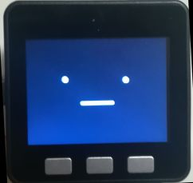

# stackchan-remocon
## StackChanをスマホ（など）でコントロール
StackChanかわいいですね。

さてこれは、そのStackChanをスマホでコントロールしようというものです。StackChanの基礎となるライブラリであるM5Stack-Avatarは色々機能がありますが、それらをいじって遊ぼうと思うとソフト（スケッチ）を書いて焼き込むという作業が必要になります。その作業が面倒くさいので、もうちょっと気軽にStackChanを動かして遊べないかな、という試みになります。今回はスマホから操作できるようにしました。（シリアルからも同様の操作が可能です）

StackChanがWiFiのアクセスポイントとなり、そこにスマホを繋ぐとWebのページが開きます。そこから操作します。
SG90などのPWMサーボのStackChanならGPIOピン番号を設定する機能がありますので動かせると思います。なお初期設定はうちの子のGPIO16/17が設定されています。

基本的には、StackChanは勝手にゆらゆら動いています。スマホからは、横から別の指示を出す感じになります。

M5Unifiedなので他でもいろんなM5Stackで動くのでは無いかと想像していますが、うちの子は古いM5Stack Basicなのでそれでしか試していません。

残念ながらうちのStackChanは音関係がダメな子なので音を出す機能は作っていません。

### 出来ること
WiFIのアクセスポイントになること、サーボ（首振り）のオンオフ、首振り角度の設定、首振りの自動動作、首振り自動動作の頻度設定、吹き出しでしゃべる（日本語可）、顔を2種から選択、顔の色を変更（プリセット8種、マニュアル設定可能）、表情設定可能（6種）、顔の回転アニメーション、顔の拡大縮小アニメーション、Webサーバ、各種一部設定の不揮発への保存、保存した設定のクリア、など

以上をWiFI接続したスマホかシリアル接続した端末から操作できます。

### ソースコード
ソースコードは基本的に、mongonta0716さんの[stack-chan-tester](https://github.com/mongonta0716/)に各種サンプルを組み合わせてロジックを足し（まくっ）たものです。引いてもいます。だらだらと長いです。

参考にしたサンプル
- M5Stack-Avatarのサンプル諸々
- SimpleWiFiServer from WiFi library
- CaptivePortal from DNSServer library
- SDWebServer from WebServer library

### ライセンス
サンプルってどういう扱いになるんでしょうね？
とりあえずstack-chan-testerに準じてMITにしようかとおもっています。

## 準備とソフトの焼き込み
まずstackchanを用意します。

そのstackchan(M5Stack)に、ここのスケッチ（inoファイル）をビルドして焼いてください。スケッチからのビルドと焼き込みの説明はweb上に山ほどあるのでそちらを見てください。ビルドには以下のライブラリをあらかじめインストールする必要があります。
- M5Unified
- M5Stack-Avatar
- ESP32Servo
- ServoEasing

焼き上がって起動したらStackChanの顔が表示されます。かわいいですね。(2度目)

## 動かしかた
ざっくり言うと、スマホでAP接続するとページがでるからそこで操作 →Enjoy! です。

初期設定では、サーボがオフになっていますので、そのまま放置してもサーボは動きません。それでも起動時に時々サーボが暴れるような動きをすることがありますが、これは原因不明です。顔は動きます。かわいいですね（3度目）

WiFiのアクセスポイントは初期設定でONになっています。スマホなどでWiFiをスキャンして見てください。初期設定にしたがい、yourAP-xxxx（xは数字かA-F）というアクセスポイントがあると思います。無かったらソフトがちゃんと動いていません。なんとかしてください。（投げ）

初期設定ではパスワードはyourPasswordです。スマホを接続してください。公衆WiFiの認証の仕組みを使ってブラウザをStackChanのページに誘導します。手元のAndroid機だとどうも複数の挙動があるようで、勝手にブラウザが立ち上がってStackChanのページを表示するときもあれば、通知として「yourAP-xxxxにログイン」と出てそれをクリックするとStackChanのページに行くこともあります。このとき、一度違うページに行くのでワンテンポ遅れます。StackChanのURLはstackchan.home.arpaにしてありますが、何処に繋いでもここに誘導されます。インターネットには繋がっていません。

[こんなページ](docs/image/sspage.jpg)が出ます。ここから顔を変えたり吹き出しでしゃべらせたり表情を変えたり色を変えたりできます。サーボのピンが16/17なら、move startで首振りを開始しましょう。
StackChanかわいいですね（4度目）

### GPIOピンの変更方法
param stringから 設定します。サーボのピン番号がX16,Y17なら記入欄にpx16py17などと書いてEnterとかGoとかやってください。空白は無しで。

設定したらページ下部のsettingsのところでx,y pin for servoの所を見てください。合ってますか？合っていたら、真ん中あたりのsave paramsを押して保存してください。

### その他StackChanの設定
下のsettingsに出てくる項目はparam stringで設定できます。基本的に英字2文字数字1-5文字で一つの設定が構成され、param stringに並べて書いてサーバに送り込むと設定されます。

これらは不揮発に保存することが出来て、save paramを押すと不揮発に保存されて次回起動時に自動設定されます。

param stringで設定しないとダメと言うことは無く、上のColor : Blueを選んだ状態で save paramsを押しても設定は保存されます。色設定その他のリンクもサーバに送るコマンドはparam stringと同じなので区別できません。

## WiFiアクセスポイントの設定
ssidとpassphraseを変えられます。これらは即時に不揮発に保存されます。ただし設定はStackChanをリセットしないと反映されません。電源ボタンを押してください。ページ中段のwifi settingsからページ遷移して設定してください。ssid:passphraseのように":"で連結して記入し、EnterかGoでStackChanに送ります。
yourAP-xxxxのyourAPは変えられますが、後ろのxxxxはM5StackのWiFiのMACアドレス下2バイトで変えられません。

## その他機能
まあ大体は、くだんのページから操作できるのですが、それ以外について。

### SDカードのファイルをサービスするWebサーバ
SDカードを有効にしておくと、StackChanのアクセスポイントに繋いだスマホなどから、それらにアクセスできます。面倒なのでhtml/txt/jpg/png/css/js位の形式しかちゃんと見てません。それ以外は全部application/octed-streamです。パスは/sd/xxxx になります。転送はかなり遅いです。

SDカードを有効にするのは、例のページの"SD enabling"のところで出来ます。save paramsすれば次回起動時も有効です。

デフォルトのページに我慢ならなくなったら自分で作れます。操作用URLはスケッチのソースかHTMLのソースを見てください。

### シリアルからの操作
シリアル接続すると、色々デバッグ情報が流れてきますが、それはまあそれとして、こちらから文字列を送るとStackChanが処理します。送る文字列は、HTTP側の文字列とほぼ同じでGET /c?speak=Hello とHTTP側で送る代わりにシリアルに c?speak=Helloと送るとStackChanがHelloと吹き出しを出します。

特別なコマンドとしてsettingsと送ると現在の設定を列挙します。

## 本体側3ボタンの機能
なにかしらリセットします。
- BtnA (左端ボタン)
  サーボモータのON/OFFがトグルします。今のところ保存設定になってないので起動したら押してください。いや、保存に変えようかな
  5秒長押しするとWiFiアクセスポイントの機能のON/OFFがトグルし、しばらく待ってリセットします。
- BtnB(中央ボタン)
  WiFiアクセスポイントの情報をQRコードで表示します。バグのため運が良くないとリセットしますが、おみくじみたいなものですが、残念なことにリセットすると保存していない設定は消えます。
- BtnC(右ボタン)
  5秒長押しで、不揮発に保存した内容（wifi以外）を消去します。
  そのまま10秒長押しで不揮発に保存したWiFi設定も消去してリセットします。

## プログラムについて
だらだらと長いです。自分用メモっぽく下記を書き残します。

基本構造
- setup()、loop()が、Webサーバ、Avatarなどの機能で分割されてsetup_hoge()、loop_hoge()になっている。あ、単語逆順もある。（ミス）
- 新しい保存設定を追加する際は、store_params() load_params()にPreferenceのコード追加、set_param()に設定のコード追加、output_currentsettings()にhtml出力追加、output_setting_json()にも追加。loop_serial()にも追加。多いな。
- 新しいコマンドを追加する場合は、process_request()を修正。ここで返すretの中身がoutput_page()の引数のfileに入って来るので、それを見て出力すべきHTMLを引数のclientにprint()
  - process_request(req)のreqは、httpのGET /xxxxxxxxのxxxxxxxxの部分が入ってます。最初のスラッシュは入りません。見れば分かりますが、雑に処理されてます。
  - process_request()はシリアル側からも呼ばれる関数です

## 終わりに
あとは思い出すか何かしたら書きます。StackChanかわいいですね（5度目）

